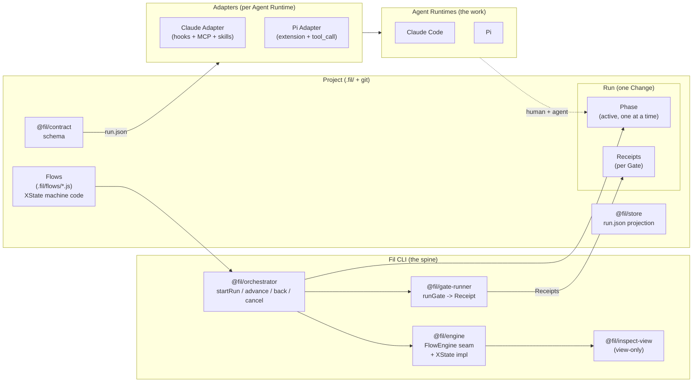

# Fil

> An open-source harness for agentic software-development lifecycles.

[](https://github.com/RemyFevry/fil/actions/workflows/ci.yml)
[](./LICENSE)
[](https://nodejs.org)
[](https://pnpm.io)

Fil is a harness that turns a software-development lifecycle into a first-class,
machine-enforced spine. A developer and their AI Agent Runtimes are guided by a
state machine — a **Flow** — whose structure the developer chooses and which
evolves as the project progresses. Fil **does not run models or agent loops**:
it owns the orchestration spine and steers external Agent Runtimes (Claude Code,
Pi, …) to do the actual work.

## Why

Most agent harnesses leave the SDLC to the human's discretion. Fil makes the
SDLC itself the first-class, machine-enforced, evolving spine: at each Phase the
active Agent Runtime is constrained (instructions, tools, context, skills) to
that phase, and leaving a phase requires passing a user-defined Gate that
produces a verification Receipt.

## Highlights

- **Flow as XState machine code** — Lifecycles are state machines authored with
  `createMachine(...)` from `@fil/engine` — the same shape as the canonical
  XState examples at <https://stately.ai/docs/xstate>. Fil owns the wrapper so Flow
  code never imports `xstate` directly.
- **Steer, don't run** — Fil runs as a sidecar governor. The human keeps their
  Agent Runtime's native UX; Fil reconfigures it per Phase via per-runtime
  Adapters.
- **User-owned Gates** — every transition is guarded by an executable test
  (shell, test suite, API call, or human-confirmation prompt). Fil runs the
  Gate and captures a Receipt with pass/fail + evidence.
- **Evolving Flows** — humans edit Flow files directly; agents propose edits as
  diffs in `.fil/proposals/`, validated by `fil approve` before they shape
  future Runs.
- **Sidecar model** — Fil is a thin CLI (`fil`) over a monorepo of focused
  modules; durable state lives in `.fil/`, Flows are committed, Runs are not.
- **Engine-agnostic seam** — XState is the default engine today; the
  `FlowEngine` interface allows future engines (a Python service, Temporal,
  …) to replace it without rewriting Flows.

## Architecture



The lifecycle hierarchy is **Project → Flow → Run → Phase**. A Project holds a
library of Flows and a history of Runs. A Flow defines its Phases, Transitions,
and Gates (committed as XState machine code). A Run binds to one Flow, snapshots
it, and carries an active Phase plus per-Gate Receipts. Fil owns the Flow,
durable Run state, Gate verification, and per-Phase configuration. The Agent
Runtime owns the model, the agent loop, context management, and the execution
environment. Adapters translate a Phase's configuration into the runtime's
native enforcement points — instruction files, permission settings, hooks, MCP
servers, skills. Enforcement is tiered (advisory config → hooks → sandbox), and
the **restrictions strategy is user-owned**.

## Quickstart

```sh
# 1. Install the Fil CLI from npm.
npm install -g fil

# 2. Inside a project repo, scaffold the durable layout + built-in Flows.
fil init

# 3. Start a Run bound to a Change (feature, fix, or refactor).
fil start "add idempotency keys to the webhook ingestor"

# 4. Look at the current Phase, its Gate, and per-Phase config.
fil status

# 5. Do the work in your Agent Runtime (Claude Code, Pi, …).
#    The Adapter enforces the Phase's instructions, tools, and context.

# 6. Advance: Fil runs the Gate and, on pass, transitions to the next Phase.
fil next

# 7. Visualize the Flow with the active Phase highlighted.
fil inspect
```

`fil init` creates `.fil/` with the `default` Flow (`Requirements → Design →
Code → Review → Done`) and the `hotfix` Flow (`Triage → Patch → Done`). Flow
files are committed; Runs (`runs/`, `run.json`) and proposals are gitignored.

## Usage example

A minimal Phase definition, taken from the shipped `default` Flow. Fil supplies
all implementations — the file is XState machine JS code, matching the
canonical example at <https://stately.ai/docs/xstate>.

```js
// .fil/flows/default.js
import { createMachine } from "@fil/engine";

export default createMachine({
  id: "default",
  initial: "design",
  context: {},
  states: {
    design: {
      meta: {
        phase: {
          instructions: "Design the approach. Sketch the data model and the key decisions. Reference ADRs.",
          allowedTools: ["read", "write", "edit"],
          skills: [],
          context: { files: ["docs/adr/", "docs/OVERVIEW.md"], priorResults: [] },
          actorMode: "collaborative",
          gate: {
            type: "human",
            prompt: "Approve the design and proceed to implementation?",
          },
        },
      },
      on: { NEXT: "code" },
    },
    code: {
      meta: {
        phase: {
          instructions: "Implement the Change. Exit gate is the test suite.",
          allowedTools: ["read", "write", "edit", "bash"],
          skills: ["tdd"],
          context: { files: ["src/"], priorResults: ["design"] },
          actorMode: "agent",
          gate: { type: "testsPass", command: "npm test" },
        },
      },
      on: { NEXT: "review" },
    },
  },
});
```

A Run prints progress as Gates fire:

```text
$ fil next
Advanced to: design
  gate (human): pass
$ fil next
Advanced to: code
  gate (testsPass): pass
```

## CLI reference

Every public verb in `packages/cli/src`. Run `fil` with no arguments to print
this list.

| Verb | Description | Example |
|---|---|---|
| `init` | Scaffold the `.fil/` layout and write the built-in Flows (idempotent). | `fil init` |
| `start <change> [--flow <name>]` | Start a Run bound to a Change; snapshots the chosen Flow. | `fil start "rate-limit the login endpoint" --flow default` |
| `next` | Run the current Phase's Gate; on pass, transition and persist the Receipt. | `fil next` |
| `status` | Print the current Phase, its Gate, actor mode, allowed tools, and instructions. | `fil status` |
| `back` | Retreat one Phase. Useful when a Gate surfaces design drift. | `fil back` |
| `cancel` | End the active Run as cancelled. | `fil cancel` |
| `propose <flow> <file>` | Write a proposed Flow edit to `.fil/proposals/` as a unified diff (never auto-applied). | `fil propose default ./flows/default.proposed.js` |
| `approve <id> [--flow <name>]` | Load- and reachability-validate a proposal, then apply it to the Flow. | `fil approve 01J... --flow default` |
| `inspect` | View the Flow with the active Phase highlighted (opens `@statelyai/inspect` in the terminal). | `fil inspect` |

A successful Run is one where every Gate passed and the terminal Phase
(`type: "final"`) was reached. Receipts are stored per Run and form the
audit trail — primitive #10 (verification & observability) made literal.

## Documentation

| Doc | Purpose |
|---|---|
| [`CONTEXT.md`](./CONTEXT.md) | Glossary. Use these terms — not synonyms. |
| [`docs/OVERVIEW.md`](./docs/OVERVIEW.md) | Design synthesis, including the "what Fil owns vs delegates" table. |
| [`docs/adr/0001-steer-dont-run.md`](./docs/adr/0001-steer-dont-run.md) | Steer existing Agent Runtimes; don't run one. |
| [`docs/adr/0002-flows-are-xstate-code.md`](./docs/adr/0002-flows-are-xstate-code.md) | Flows are engine-native code; reuse the chosen engine, don't reinvent. |
| [`docs/adr/0003-xstate-isolated-behind-flowengine-seam.md`](./docs/adr/0003-xstate-isolated-behind-flowengine-seam.md) | XState is the default engine, behind a cross-language `FlowEngine` seam. |

## Packages

`fil` is a pnpm workspace monorepo. The CLI (`@fil/cli`) is a thin wiring
layer; everything else is a focused module.

| Package | Responsibility |
|---|---|
| `@fil/contract` | The `.fil/run.json` schema + serializers/validators — the single source of truth every Adapter reads. |
| `@fil/engine` | The `FlowEngine` seam (ADR-0003) plus the default XState implementation (ADR-0002). Ships `createMachine` (the Flow author-facing wrapper) and the built-in Flows (`default`, `hotfix`). |
| `@fil/flow-loader` | Resolves Flow files across project/user precedence and load-validates the chosen config. |
| `@fil/store` | Repository over `.fil/`: Runs, the `run.json` projection, Flow snapshots, and proposals. |
| `@fil/orchestrator` | `startRun / advance / back / cancel` — drives the Flow via the engine and gate-runner, persists through the store. |
| `@fil/gate-runner` | `runGate(gateSpec, ctx) → Receipt`. Executes shell, test-suite, and human-confirmation gates and captures evidence. |
| `@fil/evolution` | Pure validation of proposed Flow patches (load + reachability) and unified-diff helpers. |
| `@fil/inspect-view` | View-only visualizer over `FlowEngine.serialize()` and the active Phase. Consumes only the seam. |
| `@fil/cli` | The `fil` command — a thin wiring over the modules above. |

## Contributing

Fil is built around the ten primitives of harness engineering: instructions,
context delivery, context management, tool interface, execution environment,
durable state, orchestration, sub-agents, skills & procedures, verification &
observability. The split between what Fil owns and what it delegates to the
Agent Runtime is documented in [`docs/OVERVIEW.md`](./docs/OVERVIEW.md). When
in doubt, read [`CONTEXT.md`](./CONTEXT.md) first — terminology is precise
(Gate ≠ check, Phase ≠ state, Receipt ≠ log) and assumes you mean what the
glossary means.

The full contributor guide lives in [`CONTRIBUTING.md`](./CONTRIBUTING.md) —
it covers local setup, the Worktrunk worktree workflow, the Conventional
Commits convention, and the Changesets-driven release process. The TL;DR:

1. Read [`CONTEXT.md`](./CONTEXT.md) and the relevant ADR in
   [`docs/adr/`](./docs/adr/).
2. Pick an issue from the
   [Fil MVP project board](https://github.com/users/RemyFevry/projects/1).
   Triage labels follow the canonical vocabulary in
   [`docs/agents/triage-labels.md`](./docs/agents/triage-labels.md). Issues
   that are grabbable carry `ready-for-agent` and have `Status = Todo`.
3. Work in a Worktrunk worktree (`wt switch -c feat/<short-name>`).
4. Add a changeset with `pnpm changeset` for any user-facing change.
5. Open a PR; CI runs `pnpm lint && pnpm lint:md && pnpm build && pnpm typecheck && pnpm test`
   on Ubuntu and macOS, Node 20 and 22.

Everyone in the project is expected to follow
[`CODE_OF_CONDUCT.md`](./CODE_OF_CONDUCT.md), and security issues are
reported privately per [`SECURITY.md`](./SECURITY.md). The repository is
MIT-licensed — see [`LICENSE`](./LICENSE). Adapters are distributed through
each Agent Runtime's native channel (Claude Code marketplace, Pi
extensions, …), not through npm.

## Status

Fil is pre-1.0 and under active development. The MVP scope is tracked in
[#21 — PRD: Fil MVP](https://github.com/RemyFevry/fil/issues/21). Issues and
PRs are tagged on the [Fil MVP project board](https://github.com/users/RemyFevry/projects/1).

## Releases

The `fil` meta-package and every `@fil/*` package are published to npm under
the MIT license. Versions are driven by
[Changesets](https://github.com/changesets/changesets) and follow
[Semantic Versioning](https://semver.org/):

1. Each PR that changes user-facing behavior adds a `.changeset/*.md` file
   (`pnpm changeset`). Pick `patch` for fixes, `minor` for backwards-compatible
   additions, `major` for breaking changes. Full guidance lives in
   [`.changeset/README.md`](./.changeset/README.md).
2. Pushing to `main` opens (or updates) a **Version Packages** PR that bumps
   the affected packages and writes their `CHANGELOG.md`. Internal-dependency
   coherence (`updateInternalDependencies: "patch"` in `.changeset/config.json`)
   means that bumping `@fil/engine` also bumps every package that depends on
   it, so published versions stay in lockstep.
3. Merging that PR runs the `release` workflow (`.github/workflows/release.yml`),
   which publishes the bumped packages to npm with
   [provenance](https://docs.npmjs.com/generating-provenance-statements) (OIDC,
   no `NPM_TOKEN` needed).

Releases are tagged `v<version>` and listed on the
[GitHub releases page](https://github.com/RemyFevry/fil/releases). Pre-releases
(`alpha`, `beta`) are published under their own npm dist-tags so users can
opt in with `npm install fil@beta`.

## License

[MIT](./LICENSE) — Copyright © 2026 Remy Fevry and contributors.
